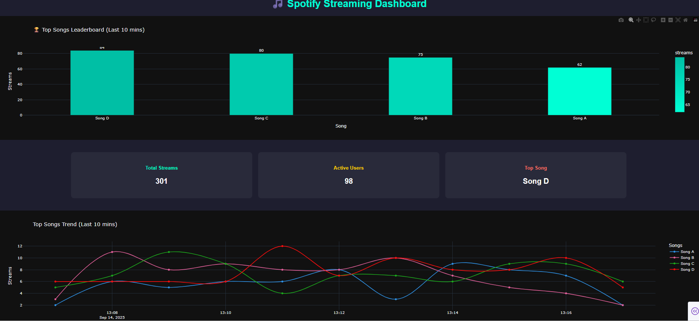

# 🎵 Spotify Streaming Dashboard  

An interactive data pipeline and dashboard project that analyzes Spotify streaming data to extract insights, visualize trends, and provide real-time analytics.  

---

## 📌 Features  
- ✅ **Data Pipeline**: Automated ETL process to clean and transform Spotify streaming data.  
- ✅ **Data Analysis**: Explore top tracks, artists, genres, and listening patterns.  
- ✅ **Dashboard**: Interactive visualizations for user engagement and insights.  
- ✅ **Scalable Design**: Easy to extend for additional datasets or APIs.  

---

## 🛠️ Tech Stack  
- **Python** – Data processing & ETL  
- **Pandas / NumPy** – Data cleaning & transformation  
- **Matplotlib / Seaborn / Plotly** – Data visualization  
- **Power BI / Excel** – Dashboarding and reporting  
- **Git & GitHub** – Version control  

---

## 📂 Project Structure  
```
Spotify_Data_Pipeline/
│── data/                # Raw & processed datasets  
│── notebooks/           # Jupyter notebooks for analysis  
│── scripts/             # Python scripts for ETL  
│── reports/             # Visualizations & dashboard exports  
│── README.md            # Project documentation  
```

---

## 🚀 How to Run  
1. Clone the repository:  
   ```bash
   git clone https://github.com/its-kanii/Spotify_Streaming_Dashboard.git
   ```
2. Navigate to the project folder:  
   ```bash
   cd Spotify_Streaming_Dashboard
   ```
3. Install dependencies:  
   ```bash
   pip install -r requirements.txt
   ```
4. Run the pipeline:  
   ```bash
   python scripts/data_pipeline.py
   ```
5. Open dashboard in Power BI / Excel for interactive exploration.  

---
## 📸 Dashboard Preview



--- 
## 📊 Insights & Use Cases  
- 🎧 Identify most-streamed songs & artists.  
- 📅 Track daily/weekly listening patterns.  
- 🌍 Compare genre popularity across regions.  
- 📈 Support decision-making for music trends.  

---

## 🤝 Contributing  
Pull requests are welcome. For major changes, please open an issue first to discuss what you’d like to change.  

---

## 📜 License  
This project is licensed under the MIT License.  
